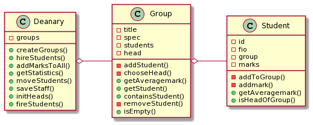

# 

## Практикум DeaneryDemo

### Разработать класс **Student** для хранения информации о студенте.

Примерный перечень полей:

- **id** - идентификационный номер
- **fio** - фамилия и инициалы
- **group** - ссылка на группу (объект Group)
- **marks** - вектор оценок

Обеспечить класс следующими методами:

- создание студента с указанием ИД и ФИО
- зачисление в группу
- добавление оценки
- вычисление средней оценки

### Разработать класс **Group** для хранения информации об учебной группе

Примерный перечень полей:

- **title** - название группы
- **spec** - специальность
- **students** - вектор ссылок на студентов
- **head** - ссылка на старосту (из членов группы)

Обеспечить класс следующими методами:

- создание группы с указанием названия
- добавление студента
- избрание старосты
- поиск студента по ФИО или ИД
- вычисление среднего балла в группе
- исключение студента из группы

### Разработать класс **Deanery**

Примерный перечень полей:

- **groups** - массив(вектор) ссылок групп

Обеспечить класс следующими методами:

- создание студентов на основе данных из файла
- создание групп на основе данных из файла
- добавление случайных оценок студентам
- получение статистики по успеваемости студентов и групп
- перевод студентов из группы в группу
- отчисление студентов за неуспеваемость
- сохранение обновленных данных в файлах
- вывод данных на консоль

Создать два файла с данными для групп и студентов (не менее 3 групп и 30 студентов). Использовать эти файлы при формировании данных групп и студентов

Написать демонстрационную версию приложения

## UML диаграмма классов

## Структура проекта

- **include/Student.h** - заголовочный файл для класса **Student**.
- **include/Group.h** - заголовочный файл для класса **Group**.
- **include/Deanary.h** - заголовочный файл для класса **Deanary**.

- **src/Student.cpp** - исходный файл для класса **Student**.
- **src/Group.cpp** - исходный файл для класса **Group**.
- **src/Deanary.cpp** - исходный файл для класса **Deanary**.
- **src/main.cpp** - домонстрационная программа.

